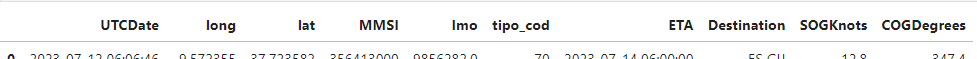
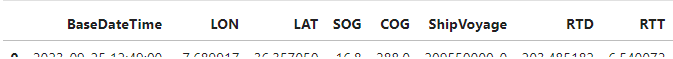

# RTT prediction with ML
 
## Description

Developed to predict Remaining Time to Travel (RTT) and, based on it, Estimated Time of Arrival (ETA) for ships to a maritime port, using AIS receiver data from the port (short-distance prediction).

## Requirements
* <a href= "https://www.python.org/"> Python 3.11.1 </a>
* <a href= "https://scikit-learn.org/stable/index.html"> Scikit-learn 1.2.1 </a>
* <a href= "https://pandas.pydata.org/"> Pandas 2.2.2 </a>
* <a href= "https://numpy.org/"> Numpy 1.26.4 </a>
* <a href= "https://matplotlib.org//"> Matlotlib </a>
* <a href= "https://seaborn.pydata.org/"> Seaborn </a>
* <a href= "https://pypi.org/project/folium/"> Folium </a>
* <a href= "https://pypi.org/project/geopandas/"> Geopandas </a>
* <a href= "https://pypi.org/project/Cartopy/"> Cartopy </a>
* <a href= "https://docs.python.org/3/library/math.html"> Math </a>

## Premises
* At least one '.txt' zipped file from AIS receiver.
* If the files are unzipped and in '.csv' format script, 'unzip_to_csv' is not needed.
* Original data (used in this work) is not available due to confidentiality issues, but the first head (zipped data received) had the following features:

* After loading and first cleaning, the appearance should have the following features:

* After features engineering and eliminating features that were unnecessary for ML models:

## Usage

### Main Folder
* 'RTT_&_ETA_predict' contains all the loading of data, data handling, EDA, and feature engineering.
* 'ETA_predict_KNN' contains the ML model using the K-nearest neighbors algorithm.
* 'ETA_predict_MLP' contains the ML model using the Multilayer Perceptron neural network.
* 'ETA_predict_KNN' contains the ML model using the Random Forest Regression technique.
* 'Raw_Data' folder to store your zipped files.
* 'CSV' folder to store all csv files and folders (output).
* 'Plots' folder to store all 'ShipVoyages' plots (output).
* 'KNN', 'MLP', and 'RF' folders to store test and train folders and files (output).

### Folder Scripts
* 'unzip_to_csv' will unzip files from 'Raw_Data' folder to one merged csv file named 'merged_dataset.csv'. Because of hardware issues, this script was adapted to automatically make some changes to data, such as eliminating unnecessary columns (based on a literature review) or selecting ships from type 70 (container cargos). It also uses the chunksize parameter to deal with the large amount of data in each dataset.
* 'splitted_csv' to split the data into several '.csv' files, each with one 'ShipVoyage' representing one single voyage of one specific ship (order by MMSI number).

## Outputs

### 'CSV' folder: 
* 'merged_dataset.csv' file - data after unzipping and converting it into one csv file.
* 'filtered_dataset' file - data after first cleaning.
* 'cleaned_dataset' file - data after complete cleaning.
* 'voyages_splitted' folder - data after splitting into 'ShipVoyage' feature. 
* 'voyage_reached' folder - data of voyages that have reached the port
* 'voyages_out' folder - data of voyages that haven't reached the port
* 'voyage_outliers' folder - data of removed outliers. 
* 'voyages_final' - final data after handled.
* correlation matrix.

### 'Plots' folder:
* 'finished_voyages' folder - plots of all finished voyages (reached the port). Inside this folder, another one named 'eliminated' contains finished voyages that were eliminated later for some reason.
* 'unfinished_voyages' folder - plots of all unfinished voyages (didn't reach the port).
* 'Outliers' - plots of outlier voyages that were removed

### 'HTML' folder
* 'Sines_map.html' - HTML map of port of Sines with defined radius (7km and 50km), and first and last register of each finished 'ShipVoyage'.
* 'excluded_voyages_map.html' - HTML map of port of Sines with defined radius (7km and 50km), and first and last register of each unfinished or excluded 'ShipVoyage'.

## Credits

 <a href= "https://github.com/marreirosj"> João Marreiros </a> 

## License
GPLv3
